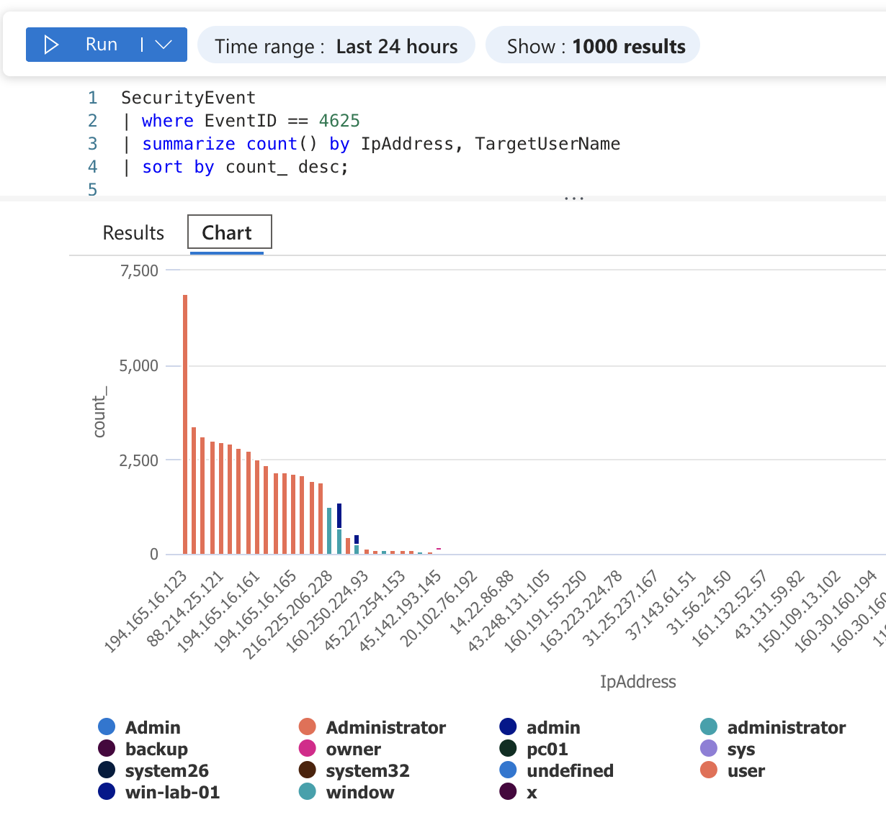
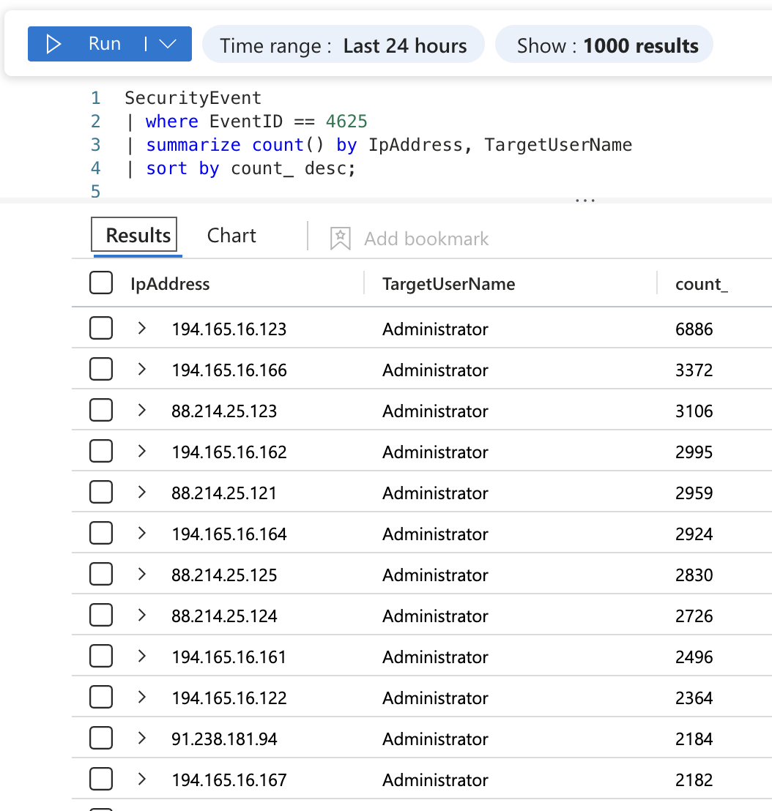

# Azure Sentinel Honeypot

A cloud-hosted honeypot built to observe and analyze real-world brute-force attacks in the wild, using Microsoft Azure and Microsoft Sentinel.

## Objective

To deploy an intentionally vulnerable, internet-facing virtual machine and use enterprise SIEM tooling to capture, query, and analyze live attack traffic - specifically automated RDP brute-force attempts from across the globe.

## Architecture

- **Virtual Machine**: Windows Server VM (`win-honeypot-01`) deployed in Azure with RDP (port 3389) intentionally exposed to the public internet as bait.
- **Resource Group**: `MISC_Honeypot_Lab` - contains all lab resources for easy teardown.
- **Log Analytics Workspace**: `misc-sentinel-workspace` - central store for ingested log data.
- **Microsoft Sentinel**: Cloud-native SIEM layered on top of the workspace, configured with a Data Collection Rule to ingest Windows Security Event logs from the VM via the Azure Monitor Agent (AMA).
- **KQL (Kusto Query Language)**: Used to query and aggregate the ingested Security Event logs.

```
Internet --> Exposed RDP (3389) --> win-honeypot-01 (Windows VM)
                                          |
                                   Security Event Logs
                                          |
                              Azure Monitor Agent (AMA)
                                          |
                         Log Analytics Workspace (misc-sentinel-workspace)
                                          |
                                  Microsoft Sentinel
                                          |
                                    KQL Queries
```

## Detection Query

Filtering for Event ID `4625` (failed logon) and aggregating by source IP and target username surfaces the brute-force pattern directly:

```kql
SecurityEvent
| where EventID == 4625
| summarize count() by IpAddress, TargetUserName
| sort by count_ desc
```

## Findings

Within hours of deployment, the honeypot was picked up by automated scanners and brute-force bots.

- **Top attacking IP**: a single address generated **6,886** failed login attempts targeting the `Administrator` account.
- **Attack concentration**: a small handful of IPs accounted for the vast majority of traffic, with a steep drop-off after the top ~10 sources - consistent with a small number of aggressive botnets doing most of the work, alongside many smaller opportunistic scanners.
- **Repeated subnet activity**: several IPs from the same `194.165.16.x` range appeared repeatedly, suggesting a single operator rotating through IPs within one hosting block rather than many independent attackers.
- **Username variety**: attackers cycled through common credential-stuffing usernames beyond just "Administrator" - including `admin`, `sys`, `backup`, `owner`, `system32`, and several host/service-style names - indicating scripted, wordlist-driven attacks rather than manual guessing.
- **Geolocation**: using KQL's `geo_info_from_ip_address()` function to enrich source IPs with country data, attack traffic was dominated by IPs geolocated to Argentina and other South American ranges, with less Russian-origin traffic than expected. This highlights an important attribution lesson: the country an IP resolves to reflects where the hosting/VPS infrastructure is located, not necessarily the attacker's actual location - cheap, loosely-regulated hosting markets are a common launch point for botnet traffic regardless of who is operating it.




## Skills Demonstrated

- Cloud infrastructure provisioning (Azure VMs, resource groups, networking)
- SIEM deployment and configuration (Microsoft Sentinel, Data Collection Rules, Azure Monitor Agent)
- KQL querying and log analysis
- Security event triage and pattern recognition (brute-force detection, IP/subnet clustering)
- IP geolocation enrichment and critical evaluation of attribution data

## Cleanup

The lab environment was fully torn down after data collection by deleting the `MISC_Honeypot_Lab` resource group, cascading the removal of the VM, workspace, and all associated resources to avoid ongoing Azure costs.
